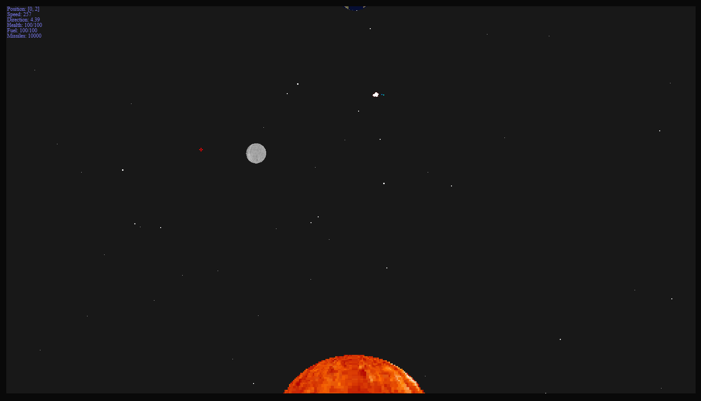

# splobe.io

2D space exploration browser game written in TypeScript with the HTML5 Canvas API.

## Controls

W/S to accelerate/decelerate. A/D to turn left/right. Q to toggle the camera lock to the player. E to toggle the crosshair (and with it the ability to shoot). Left mouse button to shoot missiles. I to toggle inventory. 1-9 to use hotbar items.

## Screenshots

